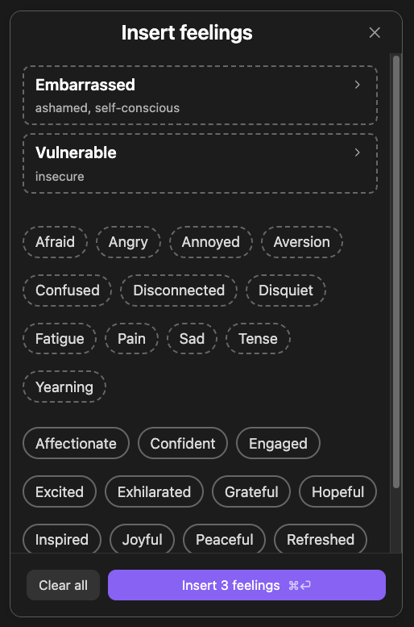
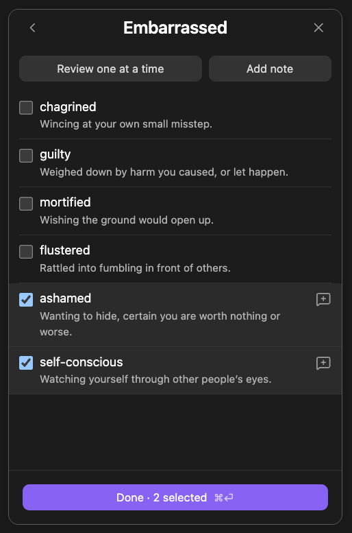
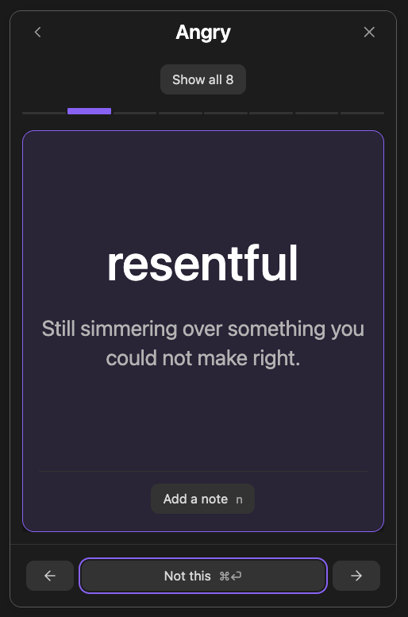
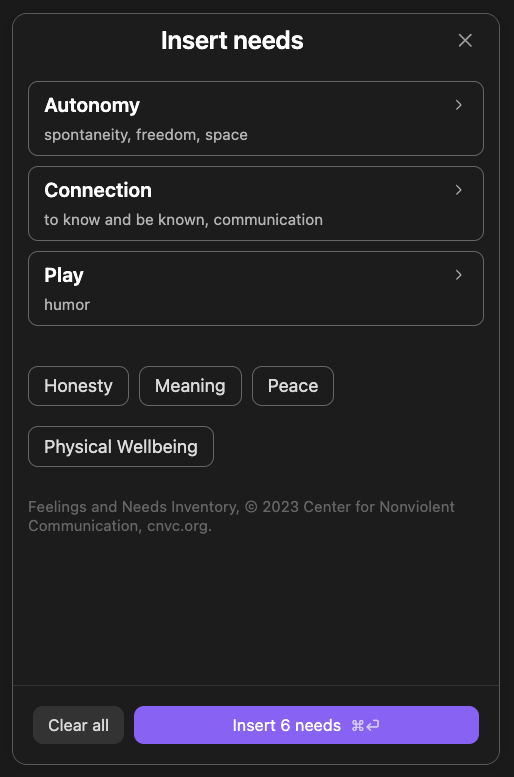

# Nonviolent Communication (NVC) Tools

Pick the feelings and needs that fit what happened, and put them into your **Obsidian** notes.
Two commands: **Insert feelings…** and **Insert needs…**



Useful for journaling, or for sitting with something that happened and working
out what it was actually about. The words come from Nonviolent Communication,
the practice Marshall Rosenberg developed, which starts from the idea that what
you feel points at a need — one that is being met, or one that is not.

## Every word comes with a definition

Open a category and you get all of it at once, each word with a line saying what
it means. That is the part that does the work: _mortified_, _flustered_ and
_chagrined_ are not the same thing, and seeing them side by side is how you find
which one you actually mean.



Or ask to be walked through the category a word at a time, which is slower and
surfaces the words you would never have picked off a list.



Either way you come out the other side with more vocabulary than you went in
with. "I feel bad" turns into something you can do something with.

## Say more about the words you picked

Any feeling or need word you chose can carry a note of your own — who it was about, what set it off, what you noticed.

## Needs



## On the phone and at the desk

The picker is built for thumbs — big targets, one screen at a time — because
some of this gets done on a phone, in the moment, away from a desk. At a desk it
is built for hands that never leave the keyboard: arrows walk the list, `n`
opens a note on whatever you are looking at, and `⌘↵` commits the screen. You
stay in the flow you came in with.

## What lands in your note

Ordinary markdown, so the note still reads with the plugin turned off:

```md
- Angry: incensed, indignant, outraged
- Peaceful: calm, content
```

With the plugin on, that block can be redrawn — grouped, one word per line, as a
sentence, as a plain line, or as a table — reopened in the picker to change what
it holds, or handed back to plain markdown for good.

## Attribution

The feelings and needs, and the categories they sit under, come from the Center
for Nonviolent Communication's Feelings and Needs Inventory, © 2023 Center for
Nonviolent Communication, [cnvc.org](https://www.cnvc.org). CNVC gives
permission to copy and share it and asks to be credited; the plugin carries that
credit under the categories in both pickers, and anything built from this code
inherits the same obligation.

The definitions are not CNVC's. The inventory is a bare word list with no
glosses — every definition here was written for this project, and any quarrel
with one is with us.

## License

[MIT](LICENSE), for this project's own code.

That covers the code only. The CNVC word lists keep their own terms, described
under Attribution above — the MIT license does not relicense them.

## Building it

See [CONTRIBUTING.md](CONTRIBUTING.md) for running the plugin from source, the
component gallery it is built out of, and how releases are cut.
